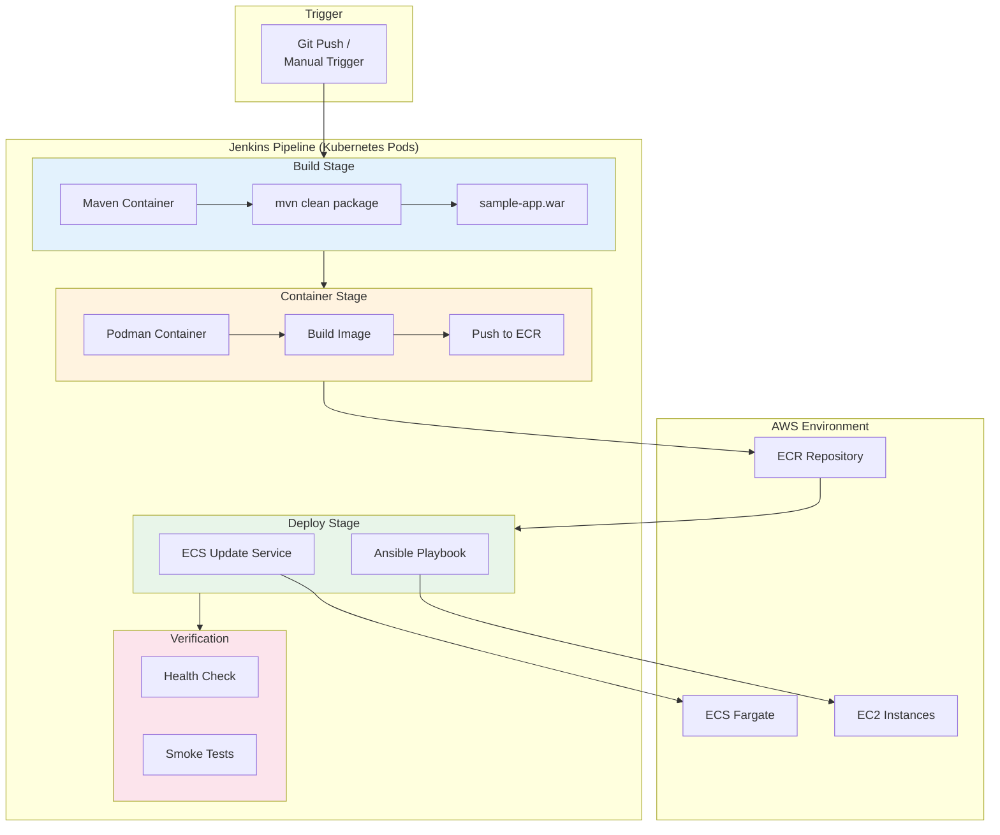
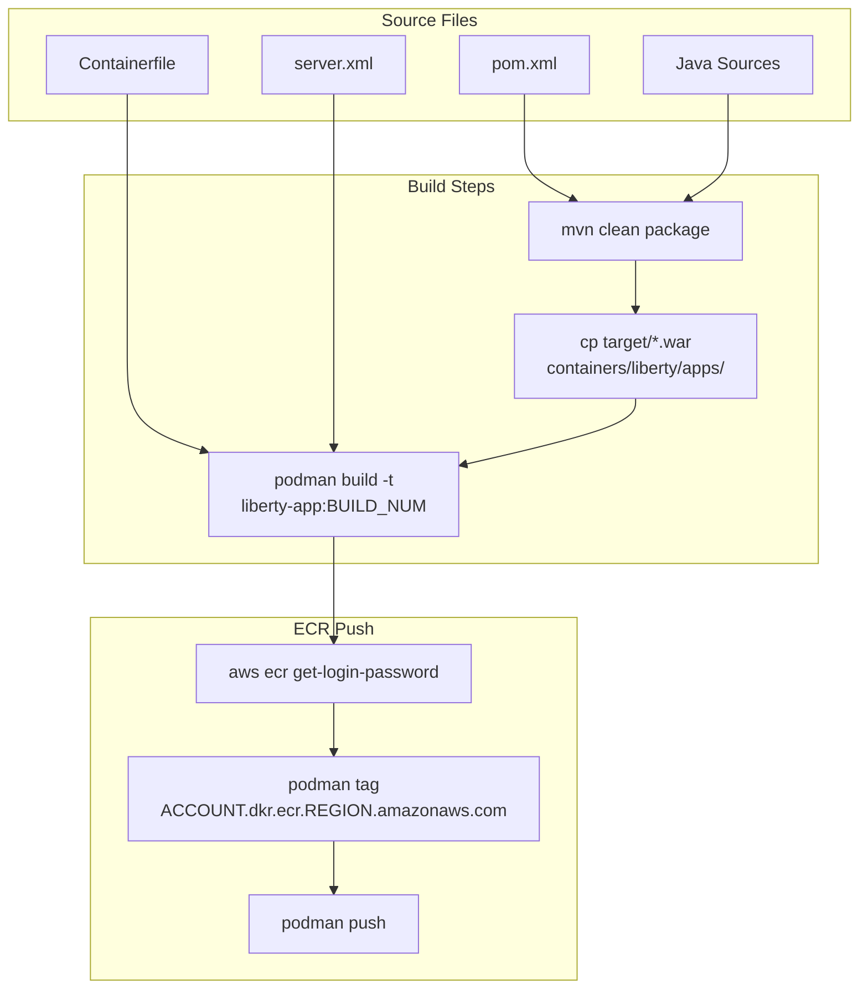

# CI/CD Pipeline Architecture

This diagram shows the Jenkins pipeline flow for building and deploying the Liberty application.

## Pipeline Overview



## Detailed Pipeline Stages

```mermaid
flowchart LR
    subgraph S1["1. Checkout"]
        CHECKOUT["Clone Repository"]
    end

    subgraph S2["2. Build"]
        BUILD_APP["Maven Build"]
        COPY_WAR["Copy WAR to<br/>container dir"]
    end

    subgraph S3["3. Container"]
        BUILD_IMG["Podman Build"]
        TAG["Tag Image"]
        PUSH["Push to ECR"]
    end

    subgraph S4["4. Deploy"]
        DEPLOY_ECS["ECS:<br/>force-new-deployment"]
        DEPLOY_EC2["EC2:<br/>Ansible Playbook"]
    end

    subgraph S5["5. Verify"]
        WAIT["Wait for<br/>Stabilization"]
        HEALTH_CHK["Health Check<br/>/health/ready"]
    end

    S1 --> S2 --> S3 --> S4 --> S5

    style S1 fill:#e1f5fe
    style S2 fill:#e8f5e9
    style S3 fill:#fff3e0
    style S4 fill:#f3e5f5
    style S5 fill:#fce4ec
```



## Pipeline Parameters

| Parameter | Options | Default | Description |
|-----------|---------|---------|-------------|
| `ENVIRONMENT` | dev, staging, prod-aws | prod-aws | Target environment |
| `DEPLOY_TYPE` | full, application-only, infrastructure-only | full | Deployment scope |
| `DRY_RUN` | true, false | false | Skip actual deployment |

## Container Build Process



## Deployment Flow by Target

### ECS Deployment
```bash
aws ecs update-service \
    --cluster mw-prod-cluster \
    --service mw-prod-liberty \
    --force-new-deployment
```

### EC2 Deployment
```bash
ansible-playbook \
    -i inventory/prod-aws-ec2.yml \
    playbooks/deploy-sample-app.yml
```

## Pipeline Artifacts

| Stage | Input | Output |
|-------|-------|--------|
| Build | Java sources, pom.xml | sample-app.war |
| Container | WAR, Containerfile, server.xml | liberty-app:BUILD_NUM image |
| Push | Local image | ECR image with tag |
| Deploy | ECR image | Running ECS tasks or EC2 deployment |
