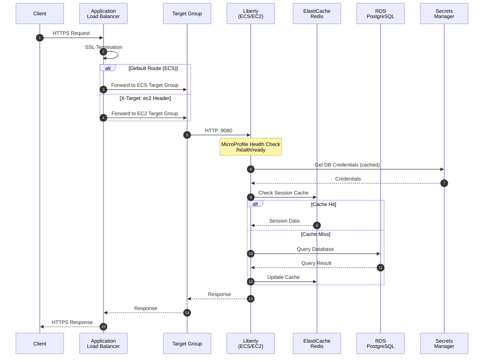
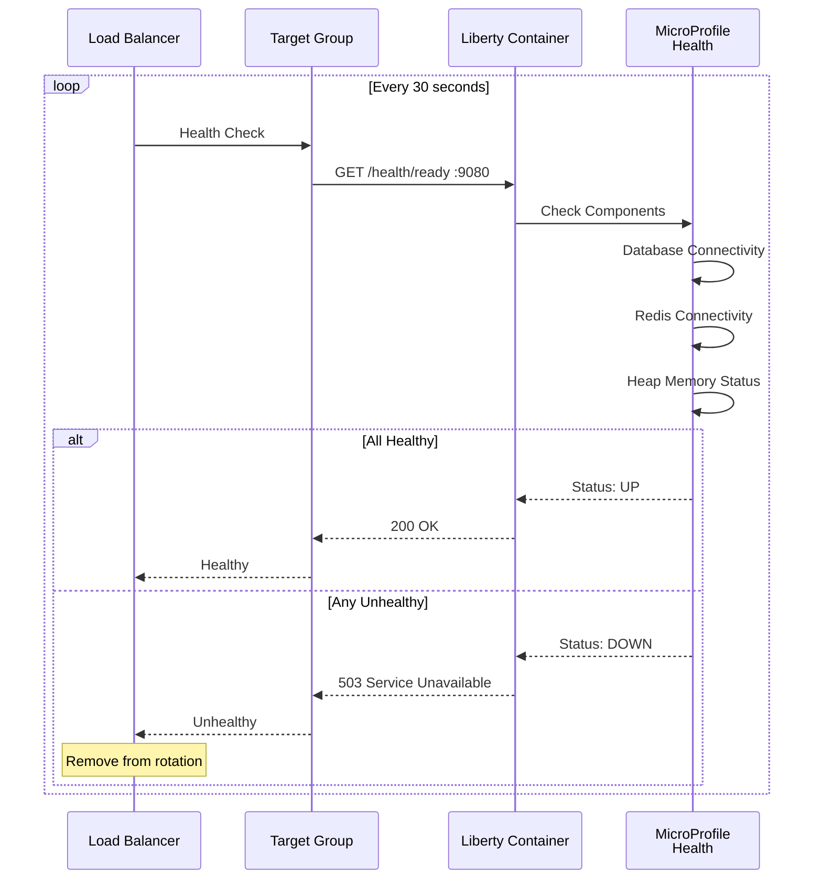
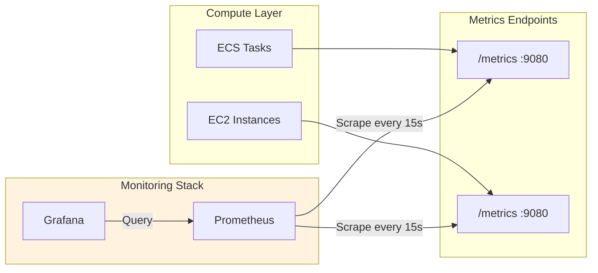

# Request Data Flow

This diagram shows how requests flow through the system from client to database.

## HTTP Request Flow

## Health Check Flow

## Metrics Collection Flow

## Data Layer Connections

| Source | Destination | Port | Protocol | Purpose |
|--------|-------------|------|----------|---------|
| ALB | Liberty | 9080 | HTTP | Application traffic |
| ALB | Liberty | 9443 | HTTPS | Admin console |
| Liberty | RDS | 5432 | PostgreSQL | Database queries |
| Liberty | Redis | 6379 | Redis | Session cache |
| Liberty | Secrets Manager | 443 | HTTPS | Credential retrieval |
| Prometheus | Liberty | 9080 | HTTP | Metrics scraping |
