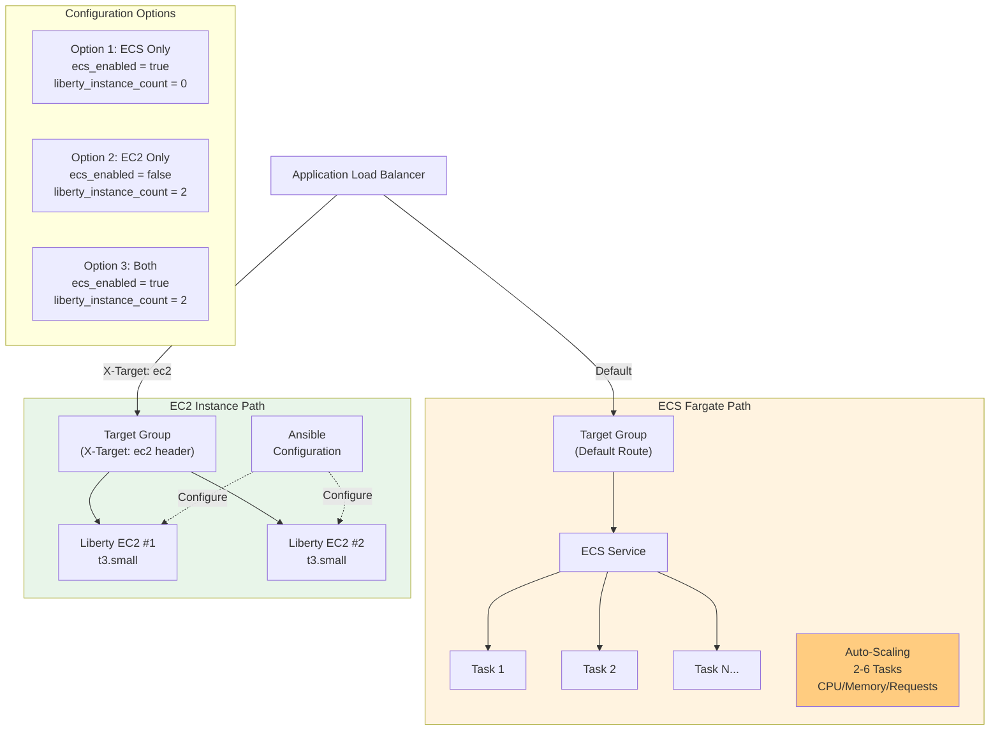
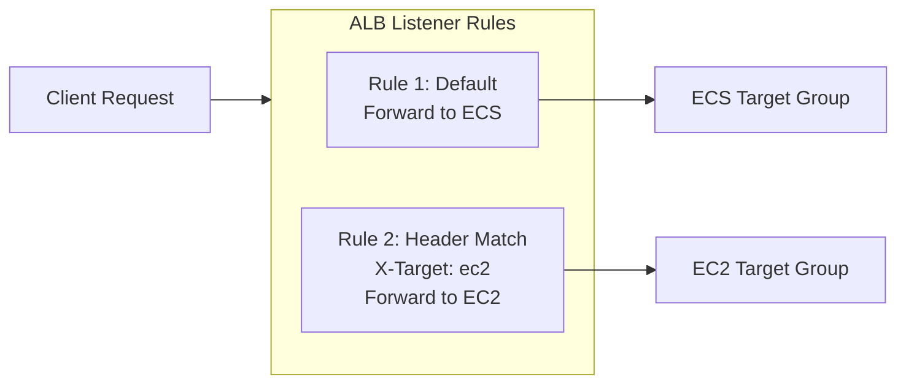

# ECS Fargate vs EC2 Deployment Comparison

This platform supports two compute models, controlled via `terraform.tfvars`.

## Feature Comparison

| Feature | ECS Fargate | EC2 Instances |
|---------|-------------|---------------|
| **Scaling** | Auto (2-6 tasks) | Manual / ASG |
| **Management** | Serverless | Full OS access |
| **Deployment** | Image pull (~2 min) | Ansible playbook (~10 min) |
| **Cost Model** | Per vCPU/memory/hour | Per instance/hour |
| **Customization** | Container only | Full system control |
| **Best For** | Production workloads | Legacy apps, debugging |

## Routing Configuration

## When to Use Each

**Choose ECS Fargate when:**
- You want minimal operational overhead
- Workloads are containerized and stateless
- You need rapid scaling
- Cost predictability is important

**Choose EC2 when:**
- You need full OS-level access
- Running legacy or non-containerized apps
- Debugging complex issues
- Cost optimization for steady-state workloads
