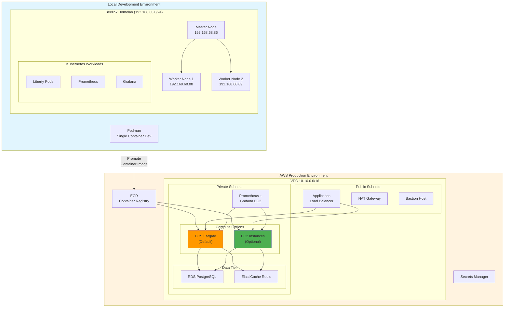

# Hybrid Architecture Overview

This diagram shows the two-environment deployment model: Local Kubernetes for development and AWS for production.

## Environment Comparison

| Aspect | Local Development | AWS Production |
|--------|------------------|----------------|
| **Compute** | Kubernetes / Podman | ECS Fargate or EC2 |
| **Networking** | 192.168.68.0/24 | VPC 10.10.0.0/16 |
| **Load Balancing** | K8s Ingress / NodePort | Application Load Balancer |
| **Database** | Local PostgreSQL | RDS PostgreSQL |
| **Cache** | Local Redis | ElastiCache Redis |
| **Monitoring** | Prometheus + Grafana | Prometheus + Grafana EC2 |
| **Cost** | Hardware only | ~$140/month |
