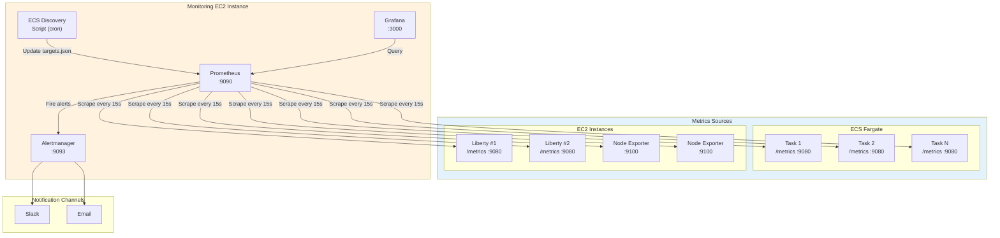
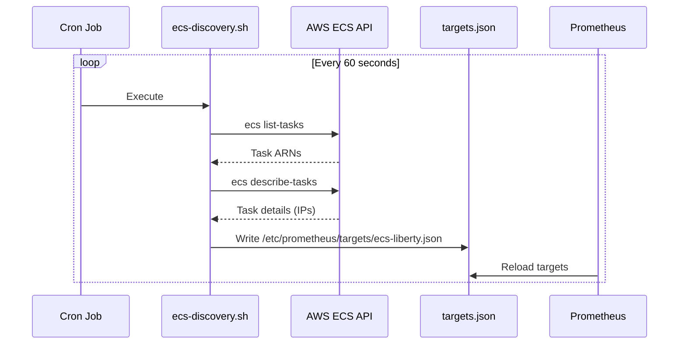
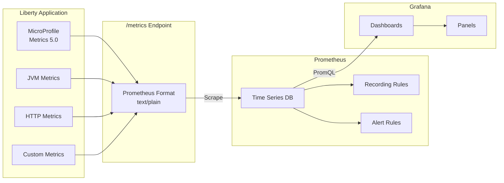
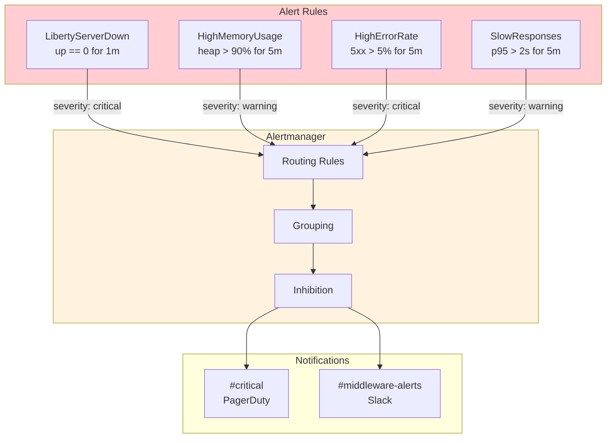

# Monitoring Architecture

This diagram shows the observability stack: Prometheus for metrics collection, Grafana for visualization, and Alertmanager for notifications.

## Monitoring Stack Overview



## ECS Service Discovery

Since standard Prometheus doesn't include ECS service discovery, we use a file-based approach:



## Metrics Flow



## Key Metrics Collected

### Application Metrics (MicroProfile Metrics 5.0)

MicroProfile Metrics 5.0 uses `mp_scope` label instead of metric prefixes:

| Metric | Type | Description |
|--------|------|-------------|
| `servlet_request_total{mp_scope="base"}` | Counter | Total HTTP requests |
| `servlet_request_elapsedTime_seconds{mp_scope="base"}` | Histogram | Request duration |
| `memory_usedHeap_bytes{mp_scope="base"}` | Gauge | JVM heap usage |
| `cpu_processCpuLoad{mp_scope="base"}` | Gauge | CPU utilization |
| `thread_count{mp_scope="base"}` | Gauge | Active threads |

### Infrastructure Metrics (Node Exporter)
| Metric | Type | Description |
|--------|------|-------------|
| `node_cpu_seconds_total` | Counter | CPU time |
| `node_memory_MemAvailable_bytes` | Gauge | Available memory |
| `node_disk_io_time_seconds_total` | Counter | Disk I/O time |
| `node_network_receive_bytes_total` | Counter | Network RX |

## Alert Configuration



## Grafana Dashboard Overview

### Liberty Overview Dashboard
- Request rate (req/sec)
- Error rate (%)
- Response time percentiles (p50, p95, p99)
- Active connections
- JVM heap usage
- Thread pool utilization

### Infrastructure Dashboard
- CPU utilization per instance
- Memory usage
- Disk I/O
- Network throughput
- ECS task count

## Access Information

| Component | URL | Default Port |
|-----------|-----|--------------|
| Prometheus | http://monitoring-ip:9090 | 9090 |
| Grafana | http://monitoring-ip:3000 | 3000 |
| Alertmanager | http://monitoring-ip:9093 | 9093 |

Grafana credentials are stored in AWS Secrets Manager and can be retrieved with:
```bash
aws secretsmanager get-secret-value \
    --secret-id mw-prod-grafana-credentials \
    --query SecretString --output text | jq -r .admin_password
```
