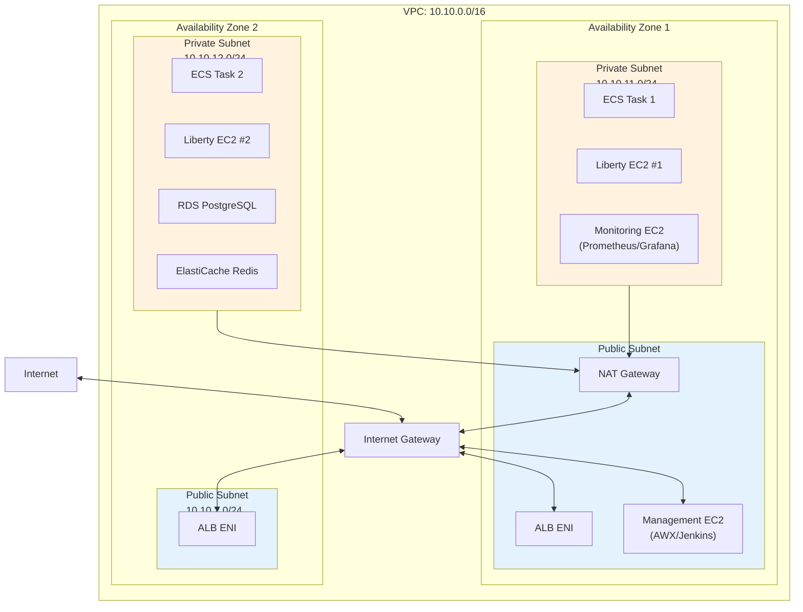
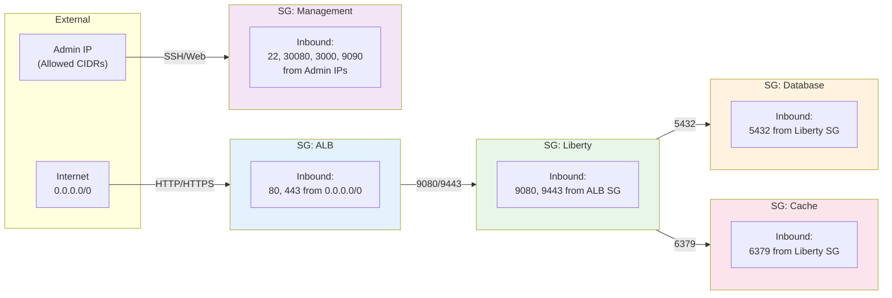
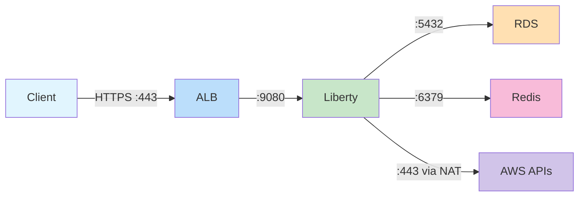

# AWS Network Topology

This diagram shows the VPC structure, subnets, and security group relationships.

## VPC Architecture

## Security Groups

## Subnet Configuration

| Subnet Type | CIDR | Resources | Internet Access |
|-------------|------|-----------|-----------------|
| Public AZ1 | 10.10.1.0/24 | ALB, NAT, Management | Direct via IGW |
| Public AZ2 | 10.10.2.0/24 | ALB | Direct via IGW |
| Private AZ1 | 10.10.11.0/24 | ECS, EC2, Monitoring | NAT Gateway |
| Private AZ2 | 10.10.12.0/24 | ECS, EC2, RDS, Redis | NAT Gateway |

## Security Group Rules

### ALB Security Group
| Direction | Port | Source | Purpose |
|-----------|------|--------|---------|
| Inbound | 80 | 0.0.0.0/0 | HTTP (redirects to HTTPS) |
| Inbound | 443 | 0.0.0.0/0 | HTTPS traffic |
| Outbound | All | 0.0.0.0/0 | Health checks |

### Liberty Security Group
| Direction | Port | Source | Purpose |
|-----------|------|--------|---------|
| Inbound | 9080 | ALB SG | HTTP application |
| Inbound | 9443 | ALB SG | HTTPS admin console |
| Outbound | 5432 | DB SG | PostgreSQL |
| Outbound | 6379 | Cache SG | Redis |
| Outbound | 443 | 0.0.0.0/0 | Secrets Manager, ECR |

### Database Security Group
| Direction | Port | Source | Purpose |
|-----------|------|--------|---------|
| Inbound | 5432 | Liberty SG | PostgreSQL connections |

### Cache Security Group
| Direction | Port | Source | Purpose |
|-----------|------|--------|---------|
| Inbound | 6379 | Liberty SG | Redis connections |

## Network Flow Summary

